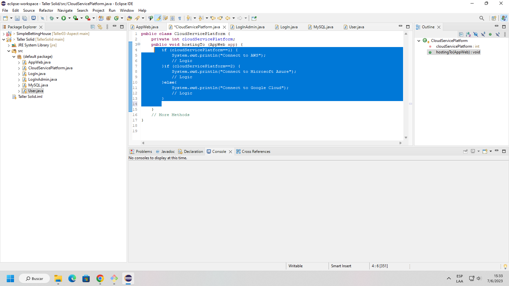
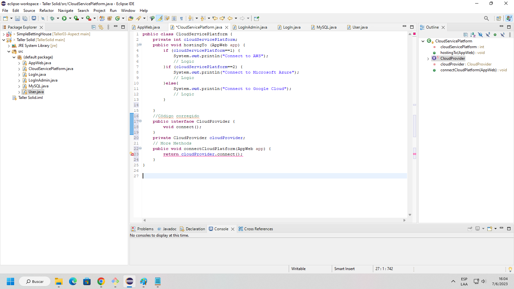

# TallerSolid

## JEREMY POVEDA

### Principio OCP es violado: Esta es una violación ya que para agregar otra base de datos al programa tendremos que modificar directamente el módulo, en lugar de extenderlo escribiendo nuevo código

### En esta implementación cada app tiene su propio método para conectarse por un host correspondiente, pero esto se puede extraer más creando interfaces para que cada web host tenga su implementación para conectarse a un servicio cloud. Además crear otra interfaz para el cloudServicePlatform para que se pueda conectar cualquier tipo de host segun se requiera